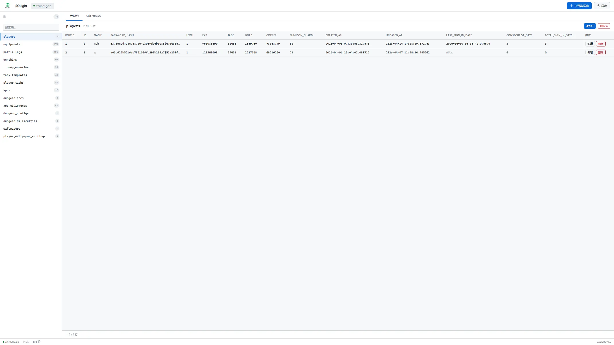
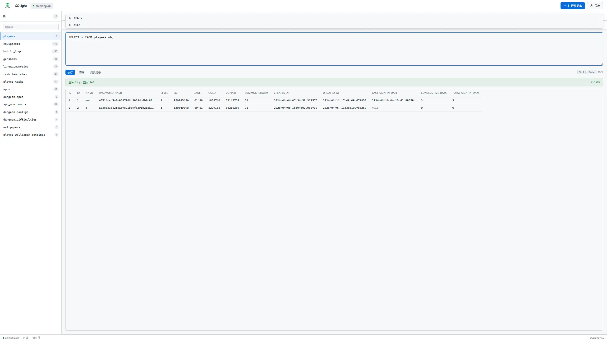

# SQLight

A browser-based SQLite database viewer and editor. No backend required — powered by [SQL.js](https://github.com/sql-js/sql.js), a WebAssembly port of SQLite.


[English](./README_EN.md) | [中文](./README.md)

## Features

- **Database Management** — Open local .db / .sqlite / .sqlite3 files, export modified database
- **Table View** — Paginated table data browsing (50 rows/page), add, edit, delete rows
- **SQL Editor** — Execute custom SQL with 8 statement templates, syntax hints, execution history
- **Smart Editing** — Auto-detect editable queries, inline cell editing support
- **Chinese Interface** — Full Simplified Chinese UI

## Screenshots

### Table View



### SQL Editor



## Quick Start

Open `index.html` directly in your browser:

```bash
# Using a local server
npx serve .
python3 -m http.server 8080
```

### Basic Usage

1. Click "打开数据库" (Open Database) in the toolbar to load a `.db` / `.sqlite` / `.sqlite3` file
2. Select a table from the sidebar to browse its data
3. Double-click a cell to edit inline, press Enter to save
4. Switch to the "SQL 编辑器" (SQL Editor) tab to run custom SQL queries
5. Click "导出" (Export) to download the modified database

## Tech Stack

- Vanilla JavaScript (ES6+), no framework dependencies
- SQL.js (SQLite WebAssembly)
- CSS custom properties with light/dark theme support
- Zero build step, single HTML file deployment

## File Structure

```
sqlight/
├── index.html          # Application entry point
├── app.js             # Application logic (~990 lines)
├── style.css          # Stylesheet (dark theme included)
├── lib/sql.js/        # SQL.js WASM files
│   ├── sql-wasm.js
│   └── sql-wasm.wasm
├── sqlight-logo.png   # Product logo
├── favicon.png        # Favicon
├── image/             # Screenshots
│   ├── 1.webp
│   └── 2.webp
└── README.md          # This file
```

## Keyboard Shortcuts

| Shortcut | Action |
|----------|--------|
| `Ctrl` + `Enter` | Execute SQL |
| `Enter` | Save cell edit |
| `Escape` | Cancel edit |

## Notes

- Database files are processed entirely locally — never uploaded to any server
- Complex queries with JOIN, UNION, or GROUP BY are read-only
- Recommended: latest Chrome, Firefox, Edge, or Safari

## License

MIT License

---

## MTI License (Full Text)

```text
MIT License

Copyright (c) 2024 SQLight

Permission is hereby granted, free of charge, to any person obtaining a copy
of this software and associated documentation files (the "Software"), to deal
in the Software without restriction, including without limitation the rights
to use, copy, modify, merge, publish, distribute, sublicense, and/or sell
copies of the Software, and to permit persons to whom the Software is
furnished to do so, subject to the following conditions:

The above copyright notice and this permission notice shall be included in all
copies or substantial portions of the Software.

THE SOFTWARE IS PROVIDED "AS IS", WITHOUT WARRANTY OF ANY KIND, EXPRESS OR
IMPLIED, INCLUDING BUT NOT LIMITED TO THE WARRANTIES OF MERCHANTABILITY,
FITNESS FOR A PARTICULAR PURPOSE AND NONINFRINGEMENT. IN NO EVENT SHALL THE
AUTHORS OR COPYRIGHT HOLDERS BE LIABLE FOR ANY CLAIM, DAMAGES OR OTHER
LIABILITY, WHETHER IN AN ACTION OF CONTRACT, TORT OR OTHERWISE, ARISING FROM,
OUT OF OR IN CONNECTION WITH THE SOFTWARE OR THE USE OR OTHER DEALINGS IN THE
SOFTWARE.
```
